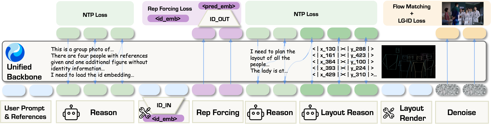

# WithEveryone: Unified Planning and Identity Grounding for Group Image Generation

[](https://arxiv.org/abs/2608.20336)

[English](README.md) | [简体中文](README_CN.md)

**Bring everyone into the frame.**

WithEveryone generates coherent group images from five to ten reference identities while preserving who is who.


## 🚀 Release Plan

An open-source release is on the way!

The research version presented in our paper is built on a foundation model whose licensing terms do not allow us to release its checkpoint.

To provide the community with an open alternative, we are actively training a new version on a foundation model that supports open release.

Code and checkpoints will be shared once the new version is ready—stay tuned!

## 🔥 How It Works

**Address every identity.** Each reference becomes a dedicated identity token.

**Plan before generation.** Identity-aware layout reasoning organizes every person in the scene.

**Supervise the right face.** Layout-Grounded ID Loss applies identity supervision to the intended region.



## 📑 Citation

Citation information will be available soon.

```bibtex
@article{xu2026witheveryone,
  title={WithEveryone: Unified Planning and Identity Grounding for Group Image Generation},
  author={Xu, Hengyuan and Wang, Qixun and Cheng, Yiji and Yang, Miles and Zhong, Zhao and Cheng, Wei and Ma, Xingjun and Jiang, Yu-Gang},
  journal={arXiv preprint arXiv:2608.20336},
  year={2026}
}
```
